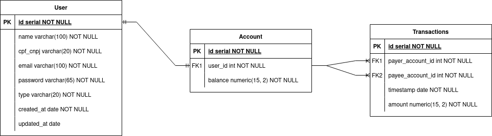

<h1 align="center">
  Fintech Startup
  <br>
</h1>

<p align="center">

  
  
  
  
  
  
  
  
  
</p>

## Índice

1. [Descrição do projeto](#descrição-do-projeto)
2. [Tecnologias](#tecnologias)
3. [Design Patterns e Metodologias](#design-patterns-e-Metodologias)
4. [Arquitetura e Armazenamento](#arquitetura-e-armazenamento)
5. [Diagrama de entidade e relacionamento](#diagrama-de-entidade-e-relacionamento)
6. [Funcionalidades do Sistema](#funcionalidades-do-sistema)
7. [Instruções de uso](#instruções-de-uso)
8. [Documentação da API](#documentação-da-api)
9. [Contribuidores](#contribuidores)

## 1. Descrição do projeto

Este projeto foi desenvolvido como parte de um desafio para uma Fintech Startup. O objetivo é fornecer uma API RESTful construída com NestJS, seguindo boas práticas de desenvolvimento e design.

## 2. Tecnologias

Principais ferramentas e tecnologias utilizadas no projeto:

- **NestJS** - Framework progressivo para construir aplicações server-side eficientes, confiáveis e escaláveis com Node.js.
- **npm** - Gerenciador de dependências
- **TypeScript** - Linguagem de programação
- **PostgreSQL** - Banco de dados relacional.
- **Prisma** - ORM para TypeScript que facilita o acesso ao banco de dados.
- **Jest** - Framework de testes para JavaScript, utilizado para garantir a qualidade do código.
- **Docker** - Plataforma de conteinerização que permite criar, testar e implantar aplicações em ambientes isolados.
- **Swagger** - Ferramenta para documentação da API
- **bcrypt** - Biblioteca para hashing de senhas
- **redis** - Sistema de cache para otimização de performance

## 3. Design Patterns e Metodologias

- **SOLID** - Princípios de design de software para promover a manutenção e escalabilidade
- **Dependency Injection** - Técnica para desacoplar componentes e facilitar a manutenção
- **Repository Pattern** - Desacoplamento da lógica de acesso a dados
- **Strategy Pattern** - Permite a adição de novos tipos de transferência sem alterar o código existente
- **Keep It Simple, Silly (KISS)** - Princípio para manter o código simples e fácil de entender

## 4. Arquitetura e Armazenamento

A aplicação adota uma arquitetura organizada com um sistema de armazenamento logs. Utiliza o Redis para caching em diversas partes da aplicação, o que ajuda a otimizar o desempenho e reduzir o tempo de resposta das operações.

Além disso, a aplicação implementa um sistema de armazenamento baseado em arquivos com identificadores de correlação. Isso garante que os dados e logs sejam armazenados de forma organizada e facilmente recuperável, facilitando a gestão e a análise dos dados através de outras ferramentas.

## 5. Diagrama de entidade e relacionamento



## 6. Funcionalidades do Sistema

A plataforma de pagamentos permite aos usuários comuns e lojistas realizar transações financeiras de forma eficiente. A seguir, estão detalhadas as principais funcionalidades da API, seus principais endpoints e regras de negócio.

Demais funcionalidades estão documentadas no [Swagger](http://localhost:3000/docs/)

### 6.1 Cadastro de Usuários

### Regras de negócio:

- O cadastro exige os campos: **Nome Completo**, **CPF**, **e-mail**, **Senha** e **Tipo de usuário**.
- Os Tipos de usuário são **COMMON** ou **MERCHANT**.
- CPF e e-mail são **únicos**, garantindo que nenhum usuário tenha dados duplicados no sistema.
- Ao cadastrar um novo usuário, uma conta bancária é automaticamente criada e associada a ele e retornada no payload.

### Principais Endpoints e Payloads

1. Criar um novo usuário

   > **POST /user**

   ```
     {
        "fullname": "Lucas Tavares",
        "email": "freirelts@gmail.com",
        "password": "123456",
        "cpfCnpj": "05423658751",
        "type": "COMMON"
     }
   ```

### 6.2 Gerenciamento de Conta

A API permite consultar e adicionar saldo nas contas dos usuários. Toda conta é criada automaticamente ao cadastrar um novo usuário e seu id é retornado na criação ou busca dos usuários.

### Principais Endpoints e Payloads

1. Consultar saldo da conta

   > **GET /get-balance/:accountId**

2. Adicionar saldo na conta

   > **PATCH /add-balance/:accountId**

   ```
     {
       "value": 200.22
     }
   ```

### 6.3 Transferências entre Contas

A API permite realizar transferências entre contas de usuários, seguindo regras específicas de validação.

### Regras de negócio:

- Usuários podem transferir dinheiro para outros usuários e lojistas.
- Lojistas não podem enviar dinheiro, apenas receber.
- Antes de realizar uma transferência, o sistema verifica se o usuário remetente (payer) possui saldo suficiente.

### Principais Endpoints e Payloads

1. Realizar transferência

   > **POST /transfer**

   ```
     {
        "value": 100.00, // Valor da transferência.
        "payer": 101, // ID da conta do usuário que está enviando o dinheiro.
        "payee": 202 // ID da conta de quem está recebendo o dinheiro.
      }
   ```

## 7. Instruções de uso

### Build e start usando docker

Para iniciar a aplicação e o banco de dados, use o comando:

```bash
docker-compose up -d
```

- Serão criados os containers fintech_app, postgres e redis
- A aplicação estará disponível em [localhost:3000/health](http://localhost:3000/health)

### Testes com Jest

Para rodar os testes, use o comando:

```bash
npm run test
```

Para cobertura de testes:

```bash
npm run test:cov
```

## 8. Documentação da API

A documentação da API está disponível em [Swagger](http://localhost:3000/docs/) após iniciar a aplicação.

## 9. Contribuidores

[Lucas Tavares](https://www.linkedin.com/in/lucas-tavares-a25323116/)
